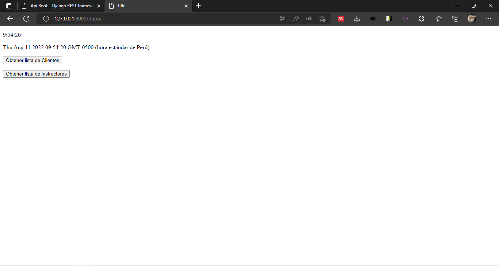
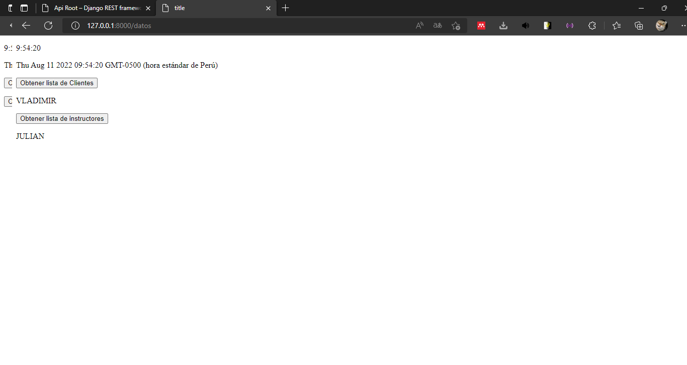

<div align="center">
<table>
    <theader>
        <tr>
            <td></td>
            <th>
                <span style="font-weight:bold;">UNIVERSIDAD NACIONAL DE SAN AGUSTIN</span><br />
                <span style="font-weight:bold;">FACULTAD DE INGENIERÍA DE PRODUCCIÓN Y SERVICIOS</span><br />
                <span style="font-weight:bold;">DEPARTAMENTO ACADÉMICO DE INGENIERÍA DE SISTEMAS E INFORMÁTICA</span><br />
                <span style="font-weight:bold;">ESCUELA PROFESIONAL DE INGENIERÍA DE SISTEMAS</span>
            </th>
            <td></td>
        </tr>
    </theader>
    <tbody>
        <tr><td colspan="3"><span style="font-weight:bold;">Formato</span>: Informe de Laboratorio</td></tr>
        <tr><td><span style="font-weight:bold;">Aprobación</span>:  2022/03/01</td><td><span style="font-weight:bold;">Código</span>: GUIA-PRLD-001</td><td><span style="font-weight:bold;">Página</span>: 1</td></tr>
    </tbody>
</table>
</div>

<div align="center">
<span style="font-weight:bold;">INFORME DE LABORATORIO</span><br />
</div>


<table>
<theader>
<tr><th colspan="6">INFORMACIÓN BÁSICA</th></tr>
</theader>
<tbody>
<tr><td>ASIGNATURA:</td><td colspan="5">Programación Web 2</td></tr>
<tr><td>TÍTULO DE LA PRÁCTICA:</td><td colspan="5">Django</td></tr>
<tr>
<td>NÚMERO DE PRÁCTICA:</td><td>05</td><td>AÑO LECTIVO:</td><td>2022 A</td><td>NRO. SEMESTRE:</td><td>III</td>
</tr>
<tr>
<td>FECHA INICIO::</td><td>30-May-2022</td><td>FECHA FIN:</td><td>03-Jun-2022</td><td>DURACIÓN:</td><td>04 horas</td>
</tr>
<tr><td colspan="6">RECURSOS:
    <ul>
        <li>https://www.w3schools.com/python/python_reference.asp</li>
        <li>https://docs.python.org/3/tutorial/</li>
        <li>https://developer.mozilla.org/es/docs/Learn/Server-side/Django/Models</li>
        <li>https://tutorial.djangogirls.org/es/django_models/</li>
        <li>https://pear.php.net/manual/en/standards.php</li>
        <li>https://docs.djangoproject.com/en/4.0/</li>

    </ul>
</td>
</<tr>
<tr><td colspan="6">INTEGRANTES:
<ul>
<li>Vladimir Arturo Sulla Quispe - vsullaq@unsa.edu.pe</li>
<li>Yozet Cozco Mauri - ycozcom@unsa.edu.pe</li>
</ul>
</td>
</<tr>
<tr><td colspan="6">DOCENTES:
<ul>
<li>Richart Smith Escobedo Quispe - rescobedoq@unsa.edu.pe</li>
</ul>
</td>
</<tr>
</tdbody>
</table>

## Solucion y Resultados

El Programa constra de las principales urls

```
router.register(r'cliente', ClienteViewSet)
router.register(r'instructor', InstructorViewSet)
urlpatterns = [
    path('datos' ,Inicio, name = "inicio"),
    path('', include(router.urls)),
    path('admin/', admin.site.urls),
    path('ovagym/', include('ovagym.urls')),
    path('api-auth/', include('rest_framework.urls', namespace='rest_framework'))
```

donde datos(http://127.0.0.1:8000/datos) corresponde a los datos que se obtiene de la api rest
quedanto inicialmente de la siguiente manera:


para luego de apretar los botones de mostrar tanto de clientes como de instructor asincronamente nos muestra los nombres requeridos


La api rest queda de la siguiente manera 


