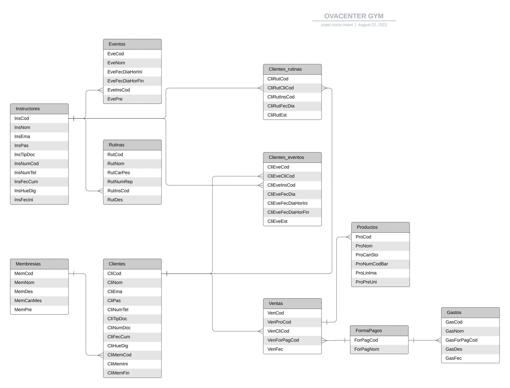

<div align="center">
<table>
    <theader>
        <tr>
            <td></td>
            <th>
                <span style="font-weight:bold;">UNIVERSIDAD NACIONAL DE SAN AGUSTIN</span><br />
                <span style="font-weight:bold;">FACULTAD DE INGENIERÍA DE PRODUCCIÓN Y SERVICIOS</span><br />
                <span style="font-weight:bold;">DEPARTAMENTO ACADÉMICO DE INGENIERÍA DE SISTEMAS E INFORMÁTICA</span><br />
                <span style="font-weight:bold;">ESCUELA PROFESIONAL DE INGENIERÍA DE SISTEMAS</span>
            </th>
            <td></td>
        </tr>
    </theader>
    <tbody>
        <tr><td colspan="3"><span style="font-weight:bold;">Formato</span>: Informe de Laboratorio</td></tr>
        <tr><td><span style="font-weight:bold;">Aprobación</span>:  2022/03/01</td><td><span style="font-weight:bold;">Código</span>: GUIA-PRLD-001</td><td><span style="font-weight:bold;">Página</span>: 1</td></tr>
    </tbody>
</table>
</div>

<div align="center">
<span style="font-weight:bold;">INFORME DE LABORATORIO</span><br />
</div>


<table>
<theader>
<tr><th colspan="6">INFORMACIÓN BÁSICA</th></tr>
</theader>
<tbody>
<tr><td>ASIGNATURA:</td><td colspan="5">Programación Web 2</td></tr>
<tr><td>TÍTULO DE LA PRÁCTICA:</td><td colspan="5">Django</td></tr>
<tr>
<td>NÚMERO DE PRÁCTICA:</td><td>05</td><td>AÑO LECTIVO:</td><td>2022 A</td><td>NRO. SEMESTRE:</td><td>III</td>
</tr>
<tr>
<td>FECHA INICIO::</td><td>30-May-2022</td><td>FECHA FIN:</td><td>03-Jun-2022</td><td>DURACIÓN:</td><td>04 horas</td>
</tr>
<tr><td colspan="6">RECURSOS:
    <ul>
        <li>https://www.w3schools.com/python/python_reference.asp</li>
        <li>https://docs.python.org/3/tutorial/</li>
        <li>https://developer.mozilla.org/es/docs/Learn/Server-side/Django/Models</li>
        <li>https://tutorial.djangogirls.org/es/django_models/</li>
        <li>https://pear.php.net/manual/en/standards.php</li>
        <li>https://docs.djangoproject.com/en/4.0/</li>

    </ul>
</td>
</<tr>
<tr><td colspan="6">INTEGRANTES:
<ul>
<li>Vladimir Arturo Sulla Quispe - vsullaq@unsa.edu.pe</li>
<li>Yozet Cozco Mauri - ycozcom@unsa.edu.pe</li>
</ul>
</td>
</<tr>
<tr><td colspan="6">DOCENTES:
<ul>
<li>Richart Smith Escobedo Quispe - rescobedoq@unsa.edu.pe</li>
</ul>
</td>
</<tr>
</tdbody>
</table>


## Tipo de sistema
    - Se trata de una aplicación web construida con el framework Django 4, un sistema que permite la administracion de usuarios de un gimnasio, con la finalidad de que los usuarios puedan registrarse, ingresar y salir de un gimnasio. Puedan darle el seguimiento a sus rutinas, establecer contacto con sus instructores, revisar las actividades que realiza el gimnasio y mucho mas.

## Requisitos del Sistema 
    - RQ 01 registro de usuarios :  El sistema debe tener un panel de registro  de usuarios. El sistema debe mostrar 
    al registrar un usuario los datos básicos de registro.
    - RQ 02 administracion de usuarios: El sistema debe presentar información completa de los usuarios, Información 
    personal del usuario , tabla de deudas relacionadas al usuario, información completa de la membresía (expiración), clases ,rutinas.
    - RQ 03 registro de clases : El sistema debe tener un panel de registro de clases. El sistema debe mostrar al 
    registrar una clase los datos básicos de registro.
    - RQ 04 registro de rutinas : El sistema debe tener un panel de registro de rutinas. El sistema debe mostrar al 
    registrar una rutina los datos básicos de registro.
    - RQ 05 Uso de tecnologías: El sistema estará construido usando las tecnologías Django, HTML, CSS, JavaScript, SQL.
    - RQ 06 Panel de vistas para usuarios: Los usuarios podrán visualizar su información,  Tablas usuarios, membresía, 
    clases, rutinas relacionadas con sí mismos, todos estos campos siendo no editables (posible funcionalidad) 
    contactar con instructores, solicitar clases, rutinas, membresías.
    - RQ 07 Generar reportes: Generar reportes de todos los usuarios activos de acuerdo a petición del cliente.
    - RQ 08 Punto de venta: La página de venta deberá permitirnos seleccionar la opción de venta ( libre, usuario) 
    tipo de pago ( contado, deuda(usuario),izzipay,yape,plin )  La deuda sólo podrá buscar y seleccionar usuarios previamente registrados.
    - RQ 09 Registro de inventario tienda: El sistema deberá permitir el registro de nuevos productos de la tienda 
    id,código de barras, nombre, características, cantidad, precio, etc.
    - RQ 10 Control de asistencia de usuarios: El sistema debera permitir llevar registro de asistencias.
    - RQ 11 Asignación de rutinas de instructores a usuarios establecidos: El sistema permitirá a los administradores/
    instructores mandar rutinas a los usuarios directamente.
    - RQ 12 Despliegue de la aplicación y base de datos: Se desplegará inicialmente en la plataforma Heroku usando 
    una base de datos relacional.
    - RQ 13 Creación de promociones suscripción por semanas o meses: El sistema debe permitir crear promociones 
    con nuevos planes, estos planes se pueden acceder temporalmente.
    - RQ 14 Panel administrador filtrado por usuarios con cumpleanos cercanos: El sistema debe tener una página 
    donde se muestre la información de los usuarios próximos a cumplir años, mostrar información: nombre, tipo membresia, 
    fecha_fin, fecha_ini, fecha cumpleanos, deudas.
    - RQ 15 Panel administrador filtrado por usuarios con membresías próximas a vencer: El sistema debe tener una 
    página que muestre una lista filtrada por usuarios con sus membresías próximas a vencer, emitir alertas a los 
    usuarios si es que les falta una semana en sus membresías.
    - RQ 16 Reportes diarios, semanal, mensual sobre las ventas: El sistema deberá permitir emitir reportes diarios,
     semanales, mensuales. filtrado por ventas:( usuario, producto,fecha,tipo_pago,precio) emitir totales por 
     ventas_contado,ventas_yape,ventas_deuda,ventas_plin, membresías.
    - RQ 17 Manejo de gastos: El sistema debe permitir el ingreso de gastos (pago  personal, pago servicios, otros).


##  Modelo de datos
    El modelo de datos esta conformado por las siguientes entidades.

    -  Clientes : En esta entidad se almacena la información de los clientes que se registran en el sistema. Ejemplo: Juan Perez, contrasena, telefono, dni, fecha cumpleanos, etc.
    -  Instructores : En esta entidad se almacena la información de los instructores que se responsabilizan de la enseñanza de los cursos. Ejemplo: Juan Perez, contrasena, telefono, dni, fecha cumpleanos, etc.
    -  Eventos : En esta entidad se almacena informacion sobre los eventos proximos a realizarse. Ejemplo: Danza, fecha, hora, lugar, etc.
    -  Rutinas : En esta entidad se almacena informacion sobre las rutinas que se realizan en el gimnasio. Ejemplo: brazos, repeticiones, peso,usuario, etc.
    -  Membresias : En esta entidad se almacena informacion sobre las membresias disponibles en el gimnasio. Ejemplo: basica, duracion, precio, etc.
    -  Ventas : En esta entidad se almacena informacion sobre las ventas que se realizan en el gimnasio. Ejemplo: usuario, producto, fecha, tipo_pago, precio, etc.
    -  Productos : En esta entidad se almacena informacion sobre los productos disponibles en el modulo de venta. Ejemplo: producto, nombre, cantidad, precio, etc.
    -  FormaPagos : En esta entidad se almacena informacion sobre las formas de pago aceptadas. Ejemplo: codigo, izzipay, yape, plin, etc.
    -  Gastos : En esta entidad se almacena informacion relacionada a los gastos(salidas). Ejemplo: pago_luz, codigo, fecha, etc.
    -  ClientesRutinas : En esta entidad se almacena informacion relacionada a las rutinas que se realizan a los clientes. Ejemplo: cliente, rutina, fecha, etc.
    -  ClientesEventos : En esta entidad se almacena informacion relacionada a los eventos que se realizan a los clientes. Ejemplo: cliente, evento, fecha, etc.

##  Diccionario de datos

    Diccionario de datos OvaCenter GYM:

| Clientes | | | | | |
| -- | -- | -- | -- | -- | -- |
| Atributo  | Tipo  | Nulo | Clave | Predeterminado | Descripción |
| CliCod  | Numerico| No | Si | Ninguno | Codigo de clientes |
| CliNam  | Cadena| No | No | Ninguno | Cliente nombre |
| CliEma  | Cadena| No | No | Ninguno | Cliente email |
| CliPas  | Cadena| No | No | Ninguno | Cliente contrasena |
| CliNumPho  | Numerico | No | No | Ninguno | Cliente numero de telefono |
| CliTipDoc  | Cadena | No | No | Ninguno | Cliente tipo de documento |
| CliDatBir  | Fecha | No | No | Ninguno | Cliente fecha de cumpleanos |
| CliDigFin  | Cadena| Si | No | NULL | Cliente huella digital |
| CliMemCod  | Numerico| No | No | Ninguno | Cliente Membresia codigo |
| CliMemIni  | Fecha| No | No | Ninguno | Cliente Membresia inicio |
| CliMemEnd  | Fecha| No | No | Ninguno | Cliente Membresia Fin |


| Ventas | | | | | |
| -- | -- | -- | -- | -- | -- |
| Atributo  | Tipo  | Nulo | Clave | Predeterminado | Descripción |
| VenCod  | Numerico| No | Si | Ninguno | Codigo venta |
| VenProCod | Numerico | No | No | Ninguno | Venta Producto Codigo |
| VenCliCod | Numerico | No | No | Ninguno | Venta Cliente codigo |
| VenForPayCod | Numerico | No | No | Ninguno | venta Pago codigo |
| VenForPayCod | Fecha| No | No | Ninguno | Venta fecha |

| Productos | | | | | |
| -- | -- | -- | -- | -- | -- |
| Atributo  | Tipo  | Nulo | Clave | Predeterminado | Descripción |
| ProCod  | Numerico| No | Si | Ninguno | Producto codigo |
| ProNam | Cadena | No | No | Ninguno | Producto nombre |
| ProCantSto | Numerico | No | No | Ninguno | Producto cantidad stock |
| ProNumCodBar | Numerico | No | No | Ninguno | Producto numero codigo de barras |
| ProLinIma | Cadena| No | No | Ninguno | Producto link imagen |
| ProUniPri | Numerico| No | No | Ninguno | Producto Precio unitario |

| Instructores | | | | | |
| -- | -- | -- | -- | -- | -- |
| Atributo  | Tipo  | Nulo | Clave | Predeterminado | Descripción |
| InsCod  | Numerico| No | Si | Ninguno | Instructor codigo |
| InsNam | Cadena | No | No | Ninguno | Instructor nombre |
| InsEma | Cadena | No | No | Ninguno | Instructor Email |
| InsPas | Cadena | No | No | Ninguno | Instructor Password |
| InsTipDoc | Cadena | No | No | Ninguno | Instructor tipo documento|
| InsNumDoc | Numerico | No | No | Ninguno | Instructor numero de documento |
| InsNumPho | Numerico | No | No | Ninguno | Instructor numero telefono |
| InsDatBir | Fecha | No | No | Ninguno | Instructor Fecha cumpleanos |
| InsDigFin | Cadena| Si | No | NULL | Instructor huella digital |
| InsFecIni | Fecha| No | No | Ninguno | Instructor fecha inicio |

| FormaPagos | | | | | |
| -- | -- | -- | -- | -- | -- |
| Atributo  | Tipo  | Nulo | Clave | Predeterminado | Descripción |
| ForPayCod | Numerico | No | Si | Ninguno | Pago codigo |
| ForPayNam | Cadena | No | No | Ninguno | Pago nombre |


| Membresias | | | | | |
| -- | -- | -- | -- | -- | -- |
| Atributo  | Tipo  | Nulo | Clave | Predeterminado | Descripción |
| MemCod  | Numerico| No | Si | Ninguno | Membresia codigo |
| MemNam | Cadena | No | No | Ninguno | Membresia Nombre |
| MemDes | Cadena | No | No | Ninguno | Membresia descripcion |
| MemQuaMon | Numerico | No | No | Ninguno | Membresia Cantidad de meses |
| MemPri | Numerico | No | No | Ninguno | Membresia precio |


| Gastos | | | | | |
| -- | -- | -- | -- | -- | -- |
| Atributo  | Tipo  | Nulo | Clave | Predeterminado | Descripción |
| GasCod  | Numerico| No | Si | Ninguno | Gasto codigo |
| GasNam | Cadena | No | No | Ninguno | Gasto nombre |
| GasForPayCod | Numerico | No | No | Ninguno | Gasto pago codigo |
| GasDes | Cadena | No | No | Ninguno | Gasto descripcion |
| GasDat | Fecha | No | No | Ninguno | Gasto fecha |


| Rutinas | | | | | |
| -- | -- | -- | -- | -- | -- |
| Atributo  | Tipo  | Nulo | Clave | Predeterminado | Descripción |
| RutCod  | Numerico| No | Si | Ninguno | Rutina codigo |
| RutNam | Cadena | No | No | Ninguno | Rutina nombre |
| RutChaWei | Cadena | No | No | Ninguno | Rutina carga peso |
| RutNumRep | Numerico | No | No | Ninguno | Rutina numero de repeticiones |
| RutInsCod | Numerico | No | No | Ninguno | Rutina instructor codigo |
| RutDes | Cadena | No | No | Ninguno | Rutina descripcion |

| Eventos | | | | | |
| -- | -- | -- | -- | -- | -- |
| Atributo  | Tipo  | Nulo | Clave | Predeterminado | Descripción |
| EveCod  | Numerico| No | Si | Ninguno | Evento codigo |
| EveNam | Cadena | No | No | Ninguno | Evento Nombre |
| EveDatDayHouIni | Cadena | No | No | Ninguno | Evento fecha dia hora Inicio |
| EveDatDayHouEnd | Numerico | No | No | Ninguno | Evento fecha dia hora fin |
| EveInsCod | Numerico | No | No | Ninguno | Evento instructor codigo |
| EvePri | Cadena | No | No | Ninguno | Evento precio |

| Clientes_rutinas | | | | | |
| -- | -- | -- | -- | -- | -- |
| Atributo  | Tipo  | Nulo | Clave | Predeterminado | Descripción |
| CliRutCliCod  | Numerico| No | Si | Ninguno | Cliente rutinas cliente codigo |
| CliRutInsCod | Cadena | No | No | Ninguno | Cliente rutionas instructor codigo |
| CliRutDatDay | Cadena | No | No | Ninguno | Cliente rutinas fecha dia |
| CliRutSta | Numerico | No | No | Ninguno | Cliente rutinas estado (no realizado, en proceso, realizado) |

| Clientes_eventos | | | | | |
| -- | -- | -- | -- | -- | -- |
| Atributo  | Tipo  | Nulo | Clave | Predeterminado | Descripción |
| CliEveCod  | Numerico| No | Si | Ninguno | Cliente eventos codigo |
| CliEveCliCod | Cadena | No | No | Ninguno | Cliente eventos cliente codigo |
| CliEveInsCod | Cadena | No | No | Ninguno | Cliente eventos instructor codigo |
| CliEveDatDay | Numerico | No | No | Ninguno | Cliente eventos fecha dia |
| CliEveDatDayHouIni | Numerico | No | No | Ninguno | Cliente eventos Fecha dia hora inicio |
| CliEveDatDayHouEnd | Cadena | No | No | Ninguno | Cliente eventos Fecha dia hora fin |
| CliEveSta | Cadena | No | No | Ninguno | Cliente eventos Estado (no realizado, en proceso, realizado) |


##  Diagrama Entidad-Relación


##  Administración con Django
    Se muestran los pasos realizados para crear el Proyecto, la aplicación, creacion de modelos, migraciones y habilitación del panel de administración en Django.
    
    creacion de proyecto Django

###  Instalación de Django

```bash
pip install django
```

###  Creación de proyecto
```bash
django-admin startproject ovagym
```
###  Creación de modelos
```bash
python manage.py makemigrations
```
###  Ejecución de migraciones
```bash
python manage.py migrate
```
###  Creación de superusuario
```bash
python manage.py createsuperuser
```
###  Ejecución del servidor
```bash
python manage.py runserver
```

##  Plantillas Bootstrap

    Se seleccionó la siguiente plantilla para el usuario final (No administrador).

    Demo online: https://www.free-css.com/free-css-templates/page276/gymnast 
    URL: https://www.free-css.com/free-css-templates

    Se muestran las actividades realizadas para adecuación de plantillas, vistas, formularios en Django.
    ...

##  CRUD - Core Business - Clientes finales
    El núcleo de negocio del sistema de inscripciones tiene valor de aceptación para los cliente finales (alumnos) radica en realizar el proceso de inscripción propiamente, que empieza desde que:
    1. El alumno inicia sesión.
    2. El alumno selecciona el o los cursos donde desea realizar una inscripción.
    3. El alumno selecciona el grupo de laboatorio donde desea incribirse.
    4. El alumno puede tener la posibilidad de anular una incripción por varias razones: cambio de grupo, corregir error, etc.
    5. El alumno puede ver el consolidado de sus inscripciones.
    6. El alumno cierra sesión.

    Todas y cada una de estas pantallas debe funcionar en la plantilla bootstrap.
    A continuación se muestran las actividades realizadas para su construcción:
    ...

##  Servicios mediante una API RESTful
    Se ha creado una aplicación que pondra a disposición cierta información para ser consumida por otros clientes HTTP.
    1. GET : Con el método get se devolverá la lista de cursos, grupos y horarios establecidos para que el alumno sobre todo vea esta información en cualquier otro medio. En formato JSON. 
    2. POST : Con este método se enviara el código del alumno y se devolvera sus inscripciones. En formato JSON.
    
    Ejemplo: Prueba en Página web, aplicación móvil, PDF, etc.
    Se especifican los pasos para crear el servicio RestFul
    ...

##  Operaciones asíncronas AJAX
    Se propone el uso de AJAX para realizar la asignación de carga académica a los docentes que estan registrados. Esta operación la realizará el usuario operador encargado por el DAISI.
    Se muestran los pasos necesarios a realizar.
    ....

##  Investigación: Email, Upload.
    - Email: Se utilizará la funcionalidad del uso de envío de correos electrónicos cuando el proceso de inscripciones culmine y al profesor le llegue la lista de alumnos inscritos en sus grupos a cargo.
    - Upload: Se utilizará esta funcionalidad para subír, archivos CSV para importar y exportar información en el sistema.
    Se muestran los pasos realizados para su funcionamiento correcto.
    ...

Github del proyecto:

URL en Heroku:

URL Playlist YouTube.
Producción de un PlayList en Youtube explicando cada una de los requerimientos.
Video 01 - Sistema - Requisitos.
Video 02 - Modelo de datos - DD - DER.
etc…


## REFERENCIAS
-   

#

[license]: https://img.shields.io/github/license/rescobedoq/pw2?label=rescobedoq
[license-file]: https://github.com/rescobedoq/pw2/blob/main/LICENSE

[downloads]: https://img.shields.io/github/downloads/rescobedoq/pw2/total?label=Downloads
[releases]: https://github.com/rescobedoq/pw2/releases/

[last-commit]: https://img.shields.io/github/last-commit/rescobedoq/pw2?label=Last%20Commit

[Debian]: https://img.shields.io/badge/Debian-D70A53?style=for-the-badge&logo=debian&logoColor=white
[debian-site]: https://www.debian.org/index.es.html

[Git]: https://img.shields.io/badge/git-%23F05033.svg?style=for-the-badge&logo=git&logoColor=white
[git-site]: https://git-scm.com/

[GitHub]: https://img.shields.io/badge/github-%23121011.svg?style=for-the-badge&logo=github&logoColor=white
[github-site]: https://github.com/

[Vim]: https://img.shields.io/badge/VIM-%2311AB00.svg?style=for-the-badge&logo=vim&logoColor=white
[vim-site]: https://www.vim.org/

[Java]: https://img.shields.io/badge/java-%23ED8B00.svg?style=for-the-badge&logo=java&logoColor=white
[java-site]: https://docs.oracle.com/javase/tutorial/


[![Debian][Debian]][debian-site]
[![Git][Git]][git-site]
[![GitHub][GitHub]][github-site]
[![Vim][Vim]][vim-site]
[![Java][Java]][java-site]


[![License][license]][license-file]
[![Downloads][downloads]][releases]
[![Last Commit][last-commit]][releases]

